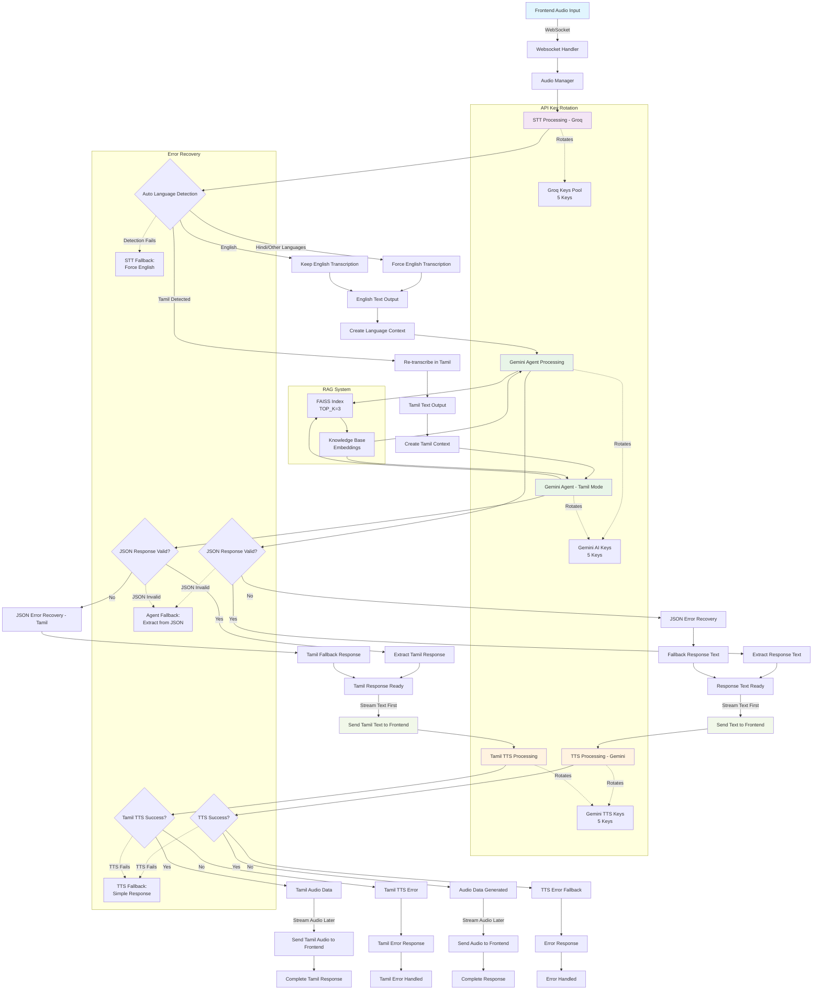

# Audio Processing Pipeline - Chopper AI Agent

This diagram shows the complete audio processing flow for the Chopper AI Agent system.



## Key Components

### Main Processing Flow
1. **Frontend Audio Input**: User speaks into microphone
2. **WebSocket Handler**: Receives audio data via WebSocket connection
3. **Audio Manager**: Orchestrates the complete audio processing pipeline
4. **STT Processing**: Groq Whisper transcribes speech to text
5. **Language Detection**: Identifies Tamil vs English vs other languages
6. **Agent Processing**: Gemini generates contextual responses
7. **TTS Processing**: Gemini converts response text back to speech
8. **Streaming Response**: Text sent first, audio sent separately

### System Architecture

#### API Key Rotation System
- **Groq STT**: 5 API keys for speech-to-text processing
- **Gemini AI**: 5 API keys for agent response generation  
- **Gemini TTS**: 5 API keys for text-to-speech synthesis
- Keys rotate automatically to prevent rate limiting

#### RAG (Retrieval Augmented Generation)
- **FAISS Index**: Vector database for knowledge retrieval
- **TOP_K=3**: Optimized for faster retrieval (reduced from 5)
- **Knowledge Base**: Embeddings for contextual information

#### Error Recovery Mechanisms
- **STT Fallback**: Force English transcription if detection fails
- **Agent Fallback**: Extract partial responses from malformed JSON
- **TTS Fallback**: Provide simple responses if synthesis fails

### Current Issues & Solutions

#### Language Detection Problem
- **Issue**: Tamil speech detected as Hindi/other languages
- **Current**: "hostel saapatu eppadi irukkum" → detected as Hindi → incorrect translation
- **Solution**: Force English transcription, then re-check for Tamil characters

#### JSON Response Errors  
- **Issue**: Gemini returns incomplete JSON: `{"response": "Hostel-la, students snacks, beverages, and'`
- **Solution**: Enhanced error recovery with text extraction from partial JSON

#### Streaming Architecture
- **Requirement**: Send text to frontend immediately, audio follows later
- **Implementation**: Separate WebSocket messages for text and audio data

## File Structure Reference

```
backend/
├── audio/
│   ├── stt.py          # Groq STT processing
│   ├── tts.py          # Gemini TTS processing  
│   └── manager.py      # Audio pipeline orchestration
├── agent/
│   └── gemini_agent.py # AI response generation
├── server/
│   └── websocket_handler.py # WebSocket communication
├── rag_faiss/
│   └── config.py       # RAG configuration (TOP_K=3)
└── config/
    ├── api_keys.py     # API key rotation management
    └── settings.py     # System configuration
```